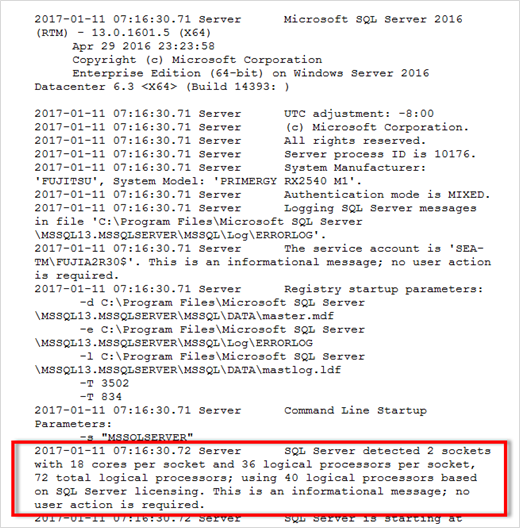
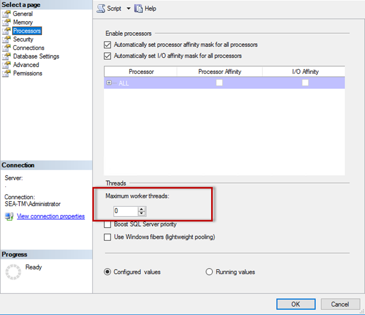

= CPU構成
:allow-uri-read: 
:firstname: [.lead]
:author: [.lead]
:authorinitials: [
:authors: [.lead]
:revdate: Modifying server and database settings can help achieve better and more efficient database performance.

== ハイパースレッディング

ハイパースレッディングはインテル独自の同時マルチスレッド(SMT)実装であり、x86マイクロプロセッサ上で実行される計算（マルチタスク）の並列化を改善します。

ハイパースレッディングを使用するハードウェアでは、論理ハイパースレッディングCPUを物理CPUとしてオペレーティングシステムに認識させることができます。SQL Serverは、オペレーティングシステムが提供する物理CPUを認識し、ハイパースレッドプロセッサを使用できるようにします。

ここで注意すべき点は、SQL Serverの各バージョンには、使用できるコンピューティング能力に独自の制限があることです。詳細については、「SQL Serverのエディション別のコンピューティング容量制限」を参照してください。

SQL Serverのライセンスを取得する際には、主に2つの考え方があります。1つ目はサーバ+クライアントアクセスライセンス（CAL）モデルと呼ばれ、2つ目はプロセッサごとのコアモデルです。SQL Serverで利用可能なすべての製品機能には、サーバ+ CAL戦略でアクセスできますが、ソケットあたりのCPUコア数はハードウェアで20に制限されています。ソケットあたり20個以上のCPUコアを搭載したサーバ用のSQL Server Enterprise Edition+CALがある場合でも、アプリケーションはそのインスタンスですべてのコアを一度に使用することはできません。この図は、起動後のSQL Serverログメッセージを示しており、コア制限の適用を示しています。

=== ログエントリは、SQL Serverの起動後に使用されているコアの数を示します。

したがって、すべてのCPUを使用するには、プロセッサ単位のコアライセンスを使用する必要があります。SQL Serverのライセンスの詳細については、を参照してください。 link:https://www.microsoft.com/en-us/sql-server/sql-server-2022-comparison["SQL Server 2022：最新データプラットフォームを実現"^]。

== CPUアフィニティ

パフォーマンスの問題が発生しない限り、プロセッサアフィニティのデフォルトを変更する必要はありませんが、その内容と動作を理解する価値はあります。

SQL Serverは、次の2つのオプションでプロセッサアフィニティをサポートします。

* CPUアフィニティマスク
* アフィニティI/Oマスク

SQL Serverは、オペレーティングシステムで使用可能なすべてのCPUを使用します（プロセッサ単位のコアライセンスが選択されている場合）。すべてのCPUにスケジューラを作成し、特定のワークロードでリソースを最大限に活用します。マルチタスクを実行する場合、オペレーティングシステムやサーバー上のその他のアプリケーションは、プロセススレッドをプロセッサ間で切り替えることができます。SQL Serverはリソースを大量に消費するアプリケーションであるため、この状況が発生するとパフォーマンスに影響する可能性があります。この影響を最小限に抑えるには、SQL Serverのすべての負荷が事前に選択されたプロセッサグループに送られるようにプロセッサを設定します。これは、CPUアフィニティマスクを使用することによって実現されます。

アフィニティI/Oマスクオプションは、SQL ServerディスクI/OをCPUのサブセットにバインドします。SQL Server OLTP環境では、この拡張により、I/O処理を実行するSQL Serverスレッドのパフォーマンスが向上します。

== 並列処理の最大次数(MAXDOP)

デフォルトでは、SQL Serverはクエリの実行中に使用可能なすべてのCPUを使用します（プロセッサ単位のコアライセンスが選択されている場合）。

これは大規模なクエリには適していますが、原因のパフォーマンスが低下し、同時実行数が制限される可能性があります。1つのCPUソケット内の物理コアの数に並列処理を制限する方法が適しています。たとえば、ソケットあたり12コアの2つの物理CPUソケットを持つサーバでは、ハイパースレッディングに関係なく、MAXDOPを12に設定する必要があります。MAXDOPでは、使用するCPUを制限したり、指定したりすることはできません。代わりに、単一のバッチクエリで使用できるCPUの数を制限します。

TIP: * NetAppでは、データウェアハウスなどのDSSの場合、この設定を50程度にしてから、必要に応じて調整することをお勧めします。アプリケーション内の重要なクエリを測定し、必要に応じて調整してください。

== ワーカースレッドの最大数

最大ワーカースレッド数オプションは、多数のクライアントがSQL Serverに接続されている場合にパフォーマンスを最適化するのに役立ちます。

通常、クエリ要求ごとに個別のオペレーティングシステムスレッドが作成されます。SQL Serverへの同時接続が数百もの場合、クエリ要求ごとに1つのスレッドが大量のシステムリソースを消費します。最大ワーカースレッド数オプションを使用すると、SQL Serverでワーカースレッドのプールを作成して多数のクエリ要求を処理できるようになるため、パフォーマンスが向上します。

デフォルト値は0で、SQL Serverは起動時にワーカースレッド数を自動的に設定できます。これはほとんどのシステムで機能します。ワーカースレッドの最大数は高度なオプションであり、経験豊富なデータベース管理者（DBA）の支援なしに変更しないでください。

より多くのワーカースレッドを使用するようにSQL Serverを設定する必要があるのはいつですか？各スケジューラの平均ワークキューの長さが1を超える場合は、負荷がCPUに制限されていないか、その他の重い待機時間が発生している場合にのみ、システムにスレッドを追加することでメリットが得られます。これらのいずれかが発生している場合、スレッドを追加しても、他のシステムボトルネックを待つことになるため、効果はありません。最大ワーカースレッド数の詳細については、を参照してください。 link:https://learn.microsoft.com/en-us/sql/database-engine/configure-windows/configure-the-max-worker-threads-server-configuration-option?view=sql-server-ver16&redirectedfrom=MSDN["max worker threadsサーバ設定オプションの設定"^]。

=== SQL Server Management Studioを使用した最大ワーカースレッド数の設定。

....
The following example shows how to configure the max work threads option using T-SQL.

EXEC sp_configure 'show advanced options', 1;

GO

RECONFIGURE ;

GO

EXEC sp_configure 'max worker threads', 900 ;

GO

RECONFIGURE;

GO
....