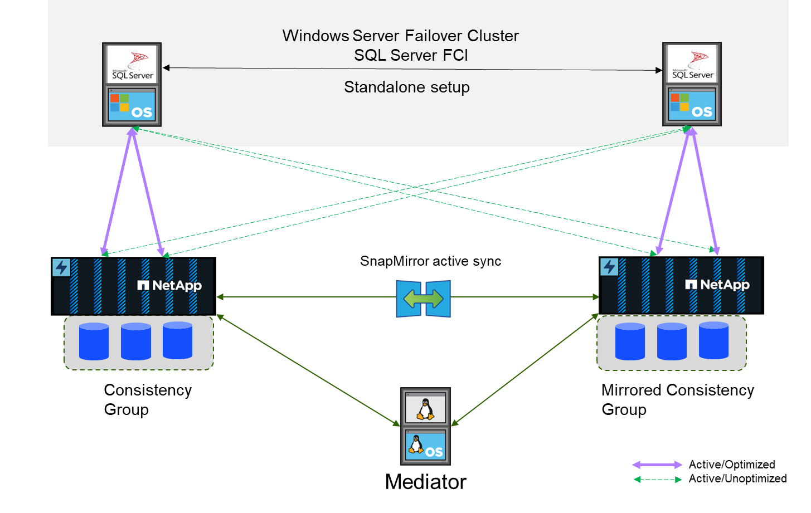

= 概要
:hardbreaks:
:allow-uri-read: 
:icons: font
:linkattrs: 
:imagesdir: ../media/

[role="lead"]
SnapMirror Active Syncを使用すると、ストレージやネットワークが停止しても、個 々 のSQL Serverデータベースとアプリケーションの運用を継続できます。透過的なストレージフェイルオーバーにより、手動操作は不要です。

ONTAP 9 .15.1以降、SnapMirrorアクティブ同期では、既存の非対称構成に加えて、対称アクティブ/アクティブアーキテクチャがサポートされます。対称アクティブ/アクティブ機能により、ビジネス継続性とディザスタリカバリのための同期双方向レプリケーションを提供します。複数の障害ドメインにわたるデータへの同時読み取り/書き込みアクセスにより、重要なSANワークロードのデータアクセスを保護し、運用を中断させず、災害やシステム障害時のダウンタイムを最小限に抑えることができます。

SQL Serverホストは、ファイバチャネル（FC）LUNまたはiSCSI LUNを使用してストレージにアクセスします。レプリケートされたデータのコピーをホストする各クラスタ間のレプリケーション。この機能はストレージレベルのレプリケーションであるため、スタンドアロンホストインスタンスまたはフェイルオーバークラスタインスタンス上で実行されているSQL Serverインスタンスは、どちらのクラスタでも読み取り/書き込み処理を実行できます。計画と設定の手順については、を参照してくださいlink:https://docs.netapp.com/us-en/ontap/snapmirror-active-sync/["SnapMirror Active Syncに関するONTAPドキュメント"]。

== 対称アクティブ/アクティブ構成のSnapMirrorアクティブ同期アーキテクチャ

**同期レプリケーション**

通常運用時には、1つの例外を除き、各コピーは常にRPO=0の同期レプリカになります。データをレプリケートできない場合、ONTAPでは、データのレプリケートという要件が解除され、一方のサイトのLUNがオフラインになる間に、一方のサイトでIOの提供が再開されます。

**ストレージハードウェア**

他のストレージディザスタリカバリソリューションとは異なり、SnapMirrorアクティブ同期は非対称プラットフォームの柔軟性を提供します。各サイトのハードウェアが同一である必要はありません。この機能を使用すると、SnapMirrorアクティブ同期をサポートするために使用するハードウェアのサイズを適正化できます。リモートストレージシステムは、本番環境のワークロードを完全にサポートする必要がある場合はプライマリサイトと同一にすることができますが、災害によってI/Oが減少した場合は、リモートサイトの小規模システムよりも対費用効果が高くなります。

** ONTAPメディエーター**

ONTAPメディエーターは、NetAppサポートからダウンロードするソフトウェアアプリケーションで、通常は小規模な仮想マシンに導入されます。ONTAPメディエーターはTiebreakerではありません。これは、SnapMirrorのアクティブな同期レプリケーションに含まれる2つのクラスタの代替通信チャネルです。自動処理は、パートナーから直接接続またはメディエーター経由で受け取った応答に基づいてONTAPによって実行されます。
