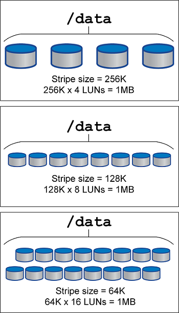

= LVMストライピング
:hardbreaks:
:allow-uri-read: 
:nofooter: 
:icons: font
:linkattrs: 
:imagesdir: ../media/

[role="lead"]
LVMストライピングとは、複数のLUNにデータを分散することです。その結果、多くのデータベースのパフォーマンスが大幅に向上します。

フラッシュドライブが登場する以前は、回転式ドライブのパフォーマンス上の制限を克服するためにストライピングが使用されていました。たとえば、OSが1MBの読み取り操作を実行する必要がある場合、1つのドライブからその1MBのデータを読み取るには、1MBがゆっくり転送されるため、多くのドライブヘッドのシークと読み取りが必要になります。この1MBのデータが8つのLUNにストライピングされている場合、OSは8つの128K読み取り処理を並行して問題できるため、1MB転送の完了に必要な時間が短縮されます。

回転ドライブによるストライピングは、I/O パターンを事前に知っておく必要があったため、より困難でした。ストライピングが実際の I/O パターンに合わせて正しく調整されていない場合、ストライピング構成によってパフォーマンスが低下する可能性があります。Oracle データベース、特にオールフラッシュ ストレージ構成では、ストライピングの構成がはるかに簡単になり、パフォーマンスが劇的に向上することが実証されています。

デフォルトではOracle ASMなどの論理ボリュームマネージャがストライプされますが、ネイティブOS LVMはストライプされません。その中には、複数のLUNを連結されたデバイスとして結合するものもあります。そのため、データファイルは1つのLUNデバイスにしか存在しません。これにより、ホットスポットが発生します。他のLVM実装では、デフォルトで分散エクステントが使用されます。これはストライピングに似ていますが、粗いです。ボリュームグループ内のLUNはエクステントと呼ばれる大きな部分にスライスされ、通常は数メガバイト単位で測定され、論理ボリュームがそれらのエクステントに分散されます。その結果、ファイルに対するランダムI/OはLUN間で適切に分散されますが、シーケンシャルI/O処理はそれほど効率的ではありません。

高いパフォーマンスを必要とするアプリケーションI/Oは、ほとんどの場合（a）基本ブロックサイズの単位または（b）1メガバイトのいずれかです。

ストライピング構成の主な目的は、シングルファイルI/Oを1つのユニットとして実行し、マルチブロックI/O（サイズは1MB）をストライピングされたボリューム内のすべてのLUNで均等に並列化できるようにすることです。つまり、ストライプ・サイズはデータベース・ブロック・サイズより小さくすることはできず、ストライプ・サイズにLUN数を掛けたサイズは1MBにする必要があります。

[NOTE]
====
Oracle データベースでの LVM ストライピングのベスト プラクティス:

* ストライプ サイズ ≥ データベース ブロック サイズ。
* 最適な並列処理を実現するには、ストライプ サイズ * LUN の数 ≈ 1 MB になります。
* スループットを最大化し、ホットスポットを回避するには、ASMディスク グループごとに複数の LUN を使用します。

====
次の図に、ストライプサイズと幅の調整に使用できる3つのオプションを示します。LUNの数は、前述のパフォーマンス要件を満たすように選択されますが、いずれの場合も、1つのストライプ内の総データ量は1MBです。

