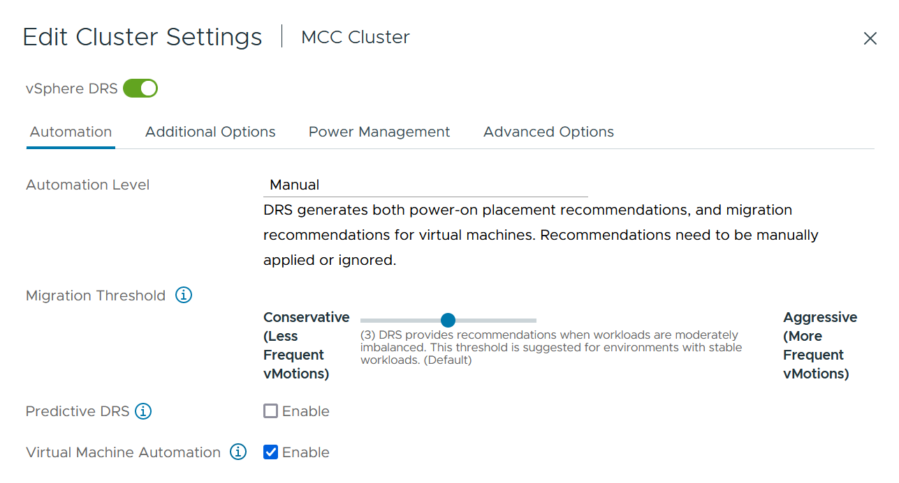

= vMSC設計および実装ガイドライン
:hardbreaks:
:allow-uri-read: 
:nofooter: 
:icons: font
:linkattrs: 
:imagesdir: ../media/

[role="lead"]
本ドキュメントでは、ONTAPストレージシステムを使用するvMSCの設計と実装のガイドラインについて説明します。

== NetAppストレージ構成

NetApp MetroCluster（MCC構成）のセットアップ手順については、次のWebサイトを参照してください。 https://docs.netapp.com/us-en/ontap-metrocluster/["MetroCluster のドキュメント"]。SnapMirrorアクティブ同期の手順については、 https://docs.netapp.com/us-en/ontap/smbc/index.html["SnapMirror のビジネス継続性機能の概要"]。

一度MetroClusterを設定すると、従来のONTAP環境を管理するようなものになります。Storage Virtual Machine（SVM）は、コマンドラインインターフェイス（CLI）、System Manager、Ansibleなどのさまざまなツールを使用してセットアップできます。SVMを設定したら、通常の運用に使用する論理インターフェイス（LIF）、ボリューム、論理ユニット番号（LUN）をクラスタに作成します。これらのオブジェクトは、クラスタピアリングネットワークを使用してもう一方のクラスタに自動的にレプリケートされます。

MetroClusterを使用していない場合は、SnapMirrorアクティブ同期を使用して、異なる障害ドメインにある複数のONTAPクラスタ間で、データストア単位でのきめ細かな保護とアクティブ/アクティブアクセスを実現できます。SnapMirrorアクティブ同期では、整合グループを使用して1つ以上のデータストア間で書き込み順序の整合性が確保されます。また、アプリケーションとデータストアの要件に応じて、複数の整合グループを作成することもできます。整合グループは、複数のデータストア間でのデータ同期が必要なアプリケーションに特に役立ちます。SnapMirror Active Syncでは、rawデバイスマッピング（RDM）とゲスト内iSCSIイニシエータを使用するゲスト接続ストレージもサポートされます。整合グループの詳細については、を参照してください。 https://docs.netapp.com/us-en/ontap/consistency-groups/index.html["整合グループの概要"]。

SnapMirrorアクティブ同期を使用するvMSC構成の管理は、MetroClusterとは多少異なります。まず、これはSANのみの構成であり、SnapMirrorのアクティブな同期でNFSデータストアを保護することはできません。次に、両方の障害ドメインのレプリケートされたデータストアにアクセスできるように、両方のLUNのコピーをESXiホストにマッピングする必要があります。

== VMware vSphere HA の場合

=== vSphere HAクラスタの作成

vSphere HAクラスタの作成は複数の手順で構成されます。詳細については、を参照してください。 https://docs.vmware.com/en/VMware-vSphere/8.0/vsphere-vcenter-esxi-management/GUID-F7818000-26E3-4E2A-93D2-FCDCE7114508.html["docs.vmware.comのvSphere Clientでクラスタを作成および構成する方法"]。つまり、最初に空のクラスタを作成してから、vCenterを使用してホストを追加し、クラスタのvSphere HAなどの設定を指定する必要があります。

*注：*このドキュメントには、このドキュメントより優先されるものはありません。 https://core.vmware.com/resource/vmware-vsphere-metro-storage-cluster-recommended-practices["VMware vSphere Metro Storage Cluster Recommended Practices"]

HAクラスタを設定するには、次の手順を実行します。

. vCenter UIに接続します。
. [Hosts and Clusters]で、HAクラスタを作成するデータセンターを選択します。
. データセンターオブジェクトを右クリックし、[New Cluster]を選択します。[Basics]で、vSphere DRSとvSphere HAが有効になっていることを確認します。ウィザードの手順を実行します。

image::../media/vmsc_3_1.png[新規クラスタ,624,302]

. クラスタを選択し、[Configure]タブに移動します。[vSphere HA]を選択し、[edit]をクリック
. [Host Monitoring]で、[Enable Host Monitoring]オプションを選択します。

image::../media/vmsc_3_2.png[[Enable Host Monitoring]オプション,624,475]

. [Failures and Responses]タブの[VM Monitoring]で、[VM Monitoring Only]オプションまたは[VM and Application Monitoring]オプションを選択します。

image::../media/vmsc_3_3.png[VMの監視,624,480]

. [Admission Control]で、[HA Admission Control]オプションを[cluster resource reserve]に設定し、50%のCPU/MEMを使用します。

image::../media/vmsc_3_4.png[アドミッション制御,624,479]

. [OK]をクリックします。
. [DRS]を選択し、[編集]をクリックします。
. アプリケーションで必要な場合を除き、自動化レベルを手動に設定します。

. VMコンポーネント保護を有効にします。を参照してください。 https://docs.vmware.com/en/VMware-vSphere/8.0/vsphere-availability/GUID-F01F7EB8-FF9D-45E2-A093-5F56A788D027.html["docs.vmware.com"]。
. MCCを使用するvMSCでは、次のvSphere HAの追加設定が推奨されます。

[cols="50%,50%"]
|===
| 失敗 | 応答 

| ホスト障害です | VMの再起動 

| ホストの分離 | 無効 

| Permanent Device Loss（PDL；永続的デバイス損失）のあるデータストア | VMの電源をオフにして再起動する 

| すべてのパスがダウンしているデータストア（APD） | VMの電源をオフにして再起動する 

| ゲストが鼓動しない | VMのリセット 

| VM再起動ポリシー | VMの重要度に応じて決定 

| ホスト隔離時の応答 | VMのシャットダウンと再起動 

| PDLを使用したデータストアの応答 | VMの電源をオフにして再起動する 

| APDを使用するデータストアの応答 | VMの電源をオフにして再起動する（控えめ） 

| APDのVMフェイルオーバーの遅延 | 3分 

| APDタイムアウトによるAPDリカバリの応答 | 無効 

| VM監視の感度 | プリセット高 
|===

=== ハートビート用のデータストアの設定

vSphere HAでは、管理ネットワークに障害が発生した場合、データストアを使用してホストと仮想マシンを監視します。vCenterでのハートビートデータストアの選択方法を設定できます。ハートビート用のデータストアを設定するには、次の手順を実行します。

. [Datastore Heartbeating]セクションで、[Use Datastores from the Specified List and Complement Automatically if Needed]を選択します。
. vCenterで使用するデータストアを両方のサイトから選択し、[OK]を押します。

image::../media/vmsc_3_6.png[概要が自動的に生成されたコンピュータのスクリーンショット,624,540]

=== 詳細オプションの設定

*ホスト障害の検出*

HAクラスタ内のホストがネットワークまたはクラスタ内の他のホストに接続できなくなると、分離イベントが発生します。デフォルトでは、vSphere HAは管理ネットワークのデフォルトゲートウェイをデフォルトの分離アドレスとして使用します。ただし、ホストがpingを実行するための追加の隔離アドレスを指定して、隔離応答をトリガーするかどうかを判断することができます。pingを実行できる隔離IPをサイトごとに1つずつ追加します。ゲートウェイIPは使用しないでください。使用するvSphere HAの詳細設定はdas.isolationaddressです。この目的には、ONTAPまたはメディエーターのIPアドレスを使用できます。

を参照してください https://core.vmware.com/resource/vmware-vsphere-metro-storage-cluster-recommended-practices#sec2-sub5["core.vmware.com"] 詳細については、_____を参照してください。

image::../media/vmsc_3_7.png[概要が自動的に生成されたコンピュータのスクリーンショット,624,545]

das.heartbeatDsPerHostという詳細設定を追加すると、ハートビートデータストアの数を増やすことができます。4つのハートビートデータストア（HB DSS）（サイトごとに2つ）を使用します。[Select from List but complent]オプションを使用します。これは、1つのサイトで障害が発生してもHB DSSが2つ必要になるためです。ただし、MCCやSnapMirrorのアクティブな同期で保護する必要はありません。

を参照してください https://core.vmware.com/resource/vmware-vsphere-metro-storage-cluster-recommended-practices#sec2-sub5["core.vmware.com"] 詳細については、_____を参照してください。

NetApp MetroCluster向けVMware DRSアフィニティ

このセクションでは、MetroCluster環境内のサイト/クラスタごとに、VMとホストのDRSグループを作成します。次に、VMホストアフィニティをローカルストレージリソースとアライメントするようにVM\Hostルールを設定します。たとえば、サイトAのVMがVMグループsitea_vmsに属し、サイトAのホストがホストグループsitea_hostsに属しているとします。次に、VM\Hostルールで、sitea_vmsをsitea_hostsのホストで実行するように記述します。

=== _ベストプラクティス_

* NetAppでは、「Must Run on Hosts in Group」という仕様ではなく、「Should Run on Hosts in Group」という仕様を使用することを強く推奨しています。サイトAのホストで障害が発生した場合、vSphere HAを使用してサイトAのVMをサイトBのホストで再起動する必要がありますが、後者の仕様では、HAがサイトBのVMを再起動することは難しいルールであるため許可されていません。前者の仕様はソフトルールであり、HAが発生した場合は違反となるため、パフォーマンスではなく可用性が確保されます。

*注：*仮想マシンがVMとホストのアフィニティルールに違反したときにトリガーされるイベントベースのアラームを作成できます。vSphere Clientで、仮想マシンの新しいアラームを追加し、イベントトリガーとして[VM is violating VM-Host Affinity Rule]を選択します。アラームの作成と編集の詳細については、を参照してください。 http://pubs.vmware.com/vsphere-51/topic/com.vmware.ICbase/PDF/vsphere-esxi-vcenter-server-51-monitoring-performance-guide.pdf["vSphereの監視とパフォーマンス"] ドキュメント

=== DRSホストグループの作成

サイトAとサイトBに固有のDRSホストグループを作成するには、次の手順を実行します。

. vSphere Web Clientで、インベントリ内のクラスタを右クリックし、[Settings]を選択します。
. [VM\Host Groups]をクリックします。
. 追加をクリックします。
. グループの名前を入力します（例：sitea_hosts）。
. [Type]メニューから[Host Group]を選択します。
. [Add]をクリックし、サイトAから目的のホストを選択して[OK]をクリックします。
. 同じ手順を繰り返して、サイトBのホストグループをもう1つ追加します。
. [OK] をクリックします。

=== DRS VMグループの作成

サイトAとサイトBに固有のDRS VMグループを作成するには、次の手順を実行します。

. vSphere Web Clientで、インベントリ内のクラスタを右クリックし、[Settings]を選択します。

. [VM\Host Groups]をクリックします。
. 追加をクリックします。
. グループの名前を入力します（例：sitea_vms）。
. [Type]メニューから[VM Group]を選択します。
. [Add]をクリックし、サイトAから目的のVMを選択して[OK]をクリックします。
. 同じ手順を繰り返して、サイトBのホストグループをもう1つ追加します。
. [OK] をクリックします。

=== VMホストルールの作成

サイトAとサイトBに固有のDRSアフィニティルールを作成するには、次の手順を実行します。

. vSphere Web Clientで、インベントリ内のクラスタを右クリックし、[Settings]を選択します。

. [VM\Host Rules]をクリックします。
. 追加をクリックします。
. ルールの名前を入力します（例：sitea_affinity）。
. Enable Ruleオプションがオンになっていることを確認します。
. [Type]メニューから[Virtual Machines to Hosts]を選択します。
. VMグループを選択します（例：sitea_vms）。
. ホストグループを選択します（例：sitea_hosts）。
. 同じ手順を繰り返して、サイトBのVM\Hostルールをもう1つ追加します。
. [OK] をクリックします。

image::../media/vmsc_3_8.png[概要が自動的に生成されたコンピュータのスクリーンショット,474,364]

== NetApp MetroCluster向けVMware vSphere Storage DRS

=== データストアクラスタの作成

各サイトのデータストアクラスタを設定するには、次の手順を実行します。

. vSphere Web Clientを使用して、[Storage]の下にあるHAクラスタが配置されているデータセンターに移動します。
. データセンターオブジェクトを右クリックし、[Storage]>[New Datastore Cluster]を選択します。
. [Turn on Storage DRS]オプションを選択し、[Next]をクリックします。
. すべてのオプションを[No Automation（Manual Mode）]に設定し、[Next]をクリックします。

==== _ベストプラクティス_

* NetAppでは、移行が必要になるタイミングを管理者が判断して制御できるように、Storage DRSを手動モードで設定することを推奨しています。

image::../media/vmsc_3_9.png[Storage DRS,528,94]

. [Enable I/O Metric for SDRS Recommendations]チェックボックスがオンになっていることを確認します。メトリック設定はデフォルト値のままにできます。

image::../media/vmsc_3_10.png[SDRの推奨事項,624,241]

. HAクラスタを選択し、[Next]をクリックします。

image::../media/vmsc_3_11.png[HAクラスタ,624,149]

. サイトAに属するデータストアを選択し、[Next]をクリックします。

image::../media/vmsc_3_12.png[データストア,624,134]

. オプションを確認し、[完了]をクリックします。
. 同じ手順を繰り返してサイトBのデータストアクラスタを作成し、サイトBのデータストアのみが選択されていることを確認します。

=== vCenter Serverの可用性

vCenter Server Appliance（VCSA）はvCenter HAで保護する必要があります。vCenter HAでは、アクティブ/パッシブHAペアに2つのVCSAを導入できます。障害ドメインごとに1つ。vCenter HAの詳細については、 https://docs.vmware.com/en/VMware-vSphere/8.0/vsphere-availability/GUID-4A626993-A829-495C-9659-F64BA8B560BD.html["docs.vmware.com"]。
