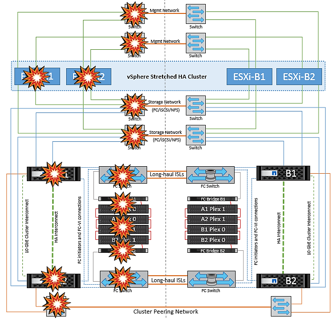

= vMSCとMetroClusterの障害シナリオ
:hardbreaks:
:allow-uri-read: 
:nofooter: 
:icons: font
:linkattrs: 
:imagesdir: ../media/

[role="lead"]
以降のセクションでは、vMSCおよびNetApp MetroClusterシステムで発生したさまざまな障害シナリオで想定される結果について説明します。

== 単一のストレージパス障害

このシナリオでは、HBAポート、ネットワークポート、フロントエンドデータスイッチポート、FCケーブル、イーサネットケーブルなどのコンポーネントで障害が発生すると、ストレージデバイスへの特定のパスがESXiホストによって停止とマークされます。HBA /ネットワーク/スイッチポートで耐障害性を提供してストレージデバイスに複数のパスが設定されている場合は、ESXiがパススイッチオーバーを実行するのが理想的です。この間、ストレージデバイスへの複数のパスを提供することでストレージの可用性が確保されるため、仮想マシンは影響を受けずに実行され続けます。

NOTE: このシナリオではMetroClusterの動作に変更はなく、すべてのデータストアがそれぞれのサイトで引き続き実行されます。

=== _ベストプラクティス_

NFS / iSCSIボリュームを使用している環境ではNetApp、NFS vmkernelポート用に少なくとも2つのネットワークアップリンクを標準vSwitchに設定し、NFS vmkernelインターフェイスが分散vSwitchにマッピングされているポートグループに設定することを推奨します。NICチーミングは、アクティブ/アクティブまたはアクティブ/スタンバイのいずれかで設定できます。

また、iSCSI LUNの場合は、vmkernelインターフェイスをiSCSIネットワークアダプタにバインドしてマルチパスを設定する必要があります。詳細については、vSphereストレージのドキュメントを参照してください。

=== _ベストプラクティス_

ファイバチャネルLUNを使用する環境でNetAppは、HBAを少なくとも2つ搭載し、HBA /ポートレベルでの耐障害性を保証することを推奨します。NetAppでは、ゾーニングを設定するためのベストプラクティスとして、単一のイニシエータから単一のターゲットへのゾーニングも推奨しています。

新規および既存のすべてのNetAppストレージデバイスにポリシーが設定されるため、Virtual Storage Console（VSC）を使用してマルチパスポリシーを設定する必要があります。

== 単一のESXiホスト障害

image::../media/vmsc_5_1.png[単一ホストの障害。,624,598]

このシナリオでは、ESXiホストで障害が発生すると、VMware HAクラスタのマスターノードがネットワークハートビートを受信しなくなるため、ホスト障害を検出します。ホストが本当に停止しているのか、ネットワークパーティションだけなのかを判別するために、マスターノードはデータストアハートビートを監視し、ハートビートがない場合は、障害が発生したホストの管理IPアドレスに対してpingを実行して最終チェックを実行します。これらのチェックがすべて無効の場合、マスターノードはこのホストを障害が発生したホストであると宣言し、この障害が発生したホストで実行されていたすべての仮想マシンが、クラスタ内の残りのホストでリブートされます。

DRSのVMとホストのアフィニティルールが設定されている場合（VMグループsitea_vmsのVMはホストグループsitea_hostsのホストを実行する必要があります）、HAマスターは最初にサイトAで使用可能なリソースを確認します。サイトAに使用可能なホストがない場合、マスターはサイトBのホストでVMの再起動を試みます。

ローカルサイトのリソースに制約がある場合は、もう一方のサイトのESXiホストで仮想マシンが起動される可能性があります。ただし、DRSのVMとホストのアフィニティルールに違反した場合は、仮想マシンをローカルサイトの稼働しているESXiホストに移行することで修正されます。DRSが手動に設定されている場合、NetAppはDRSを起動し、推奨事項を適用して仮想マシンの配置を修正することを推奨します。

このシナリオではMetroClusterの動作に変更はなく、すべてのデータストアがそれぞれのサイトで引き続き実行されます。

== ESXiホストの分離

image::../media/vmsc_5_2.png[ESXiホストの分離,624,301]

このシナリオでは、ESXiホストの管理ネットワークが停止すると、HAクラスタ内のマスターノードがハートビートを受信しなくなり、このホストがネットワークから分離された状態になります。障害が発生したか、隔離されているだけかを判別するために、マスターノードはデータストアハートビートの監視を開始します。ホストが存在する場合、ホストはマスターノードによって分離されていると宣言されます。構成されている隔離時の対応に応じて、ホストは仮想マシンの電源をオフにするか、シャットダウンするか、仮想マシンの電源をオンにしたままにするかを選択できます。分離応答のデフォルトの間隔は30秒です。

このシナリオではMetroClusterの動作に変更はなく、すべてのデータストアがそれぞれのサイトで引き続き実行されます。

== ディスクシェルフの障害

このシナリオでは、3本以上のディスクまたはシェルフ全体で障害が発生しています。データは、データサービスを中断することなく、稼働しているプレックスから提供されます。ディスク障害は、ローカルまたはリモートのプレックスに影響する可能性があります。アクティブなプレックスが1つしかないため、アグリゲートはデグレードモードになります。障害が発生したディスクを交換すると、影響を受けたアグリゲートが自動的に再同期されてデータが再構築されます。再同期後、アグリゲートは自動的に通常のミラーモードに戻ります。単一のRAIDグループ内の3本以上のディスクで障害が発生した場合は、プレックスを再構築する必要があります。

image::../media/vmsc_5_3.png[単一のディスクシェルフ障害。,624,576]

*[メモ]

* この間、仮想マシンのI/O処理には影響はありませんが、データにはISLリンクを介してリモートのディスクシェルフからアクセスされるため、パフォーマンスが低下します。

== 単一のストレージコントローラ障害

このシナリオでは、一方のサイトの2台のストレージコントローラのどちらかで障害が発生します。各サイトにHAペアがあるため、一方のノードで障害が発生すると、もう一方のノードへのフェイルオーバーが透過的かつ自動的にトリガーされます。たとえば、ノードA1に障害が発生した場合、そのストレージとワークロードは自動的にノードA2に転送されます。すべてのプレックスが引き続き使用可能なため、仮想マシンに影響はありません。2つ目のサイトのノード（B1とB2）は影響を受けません。また、クラスタ内のマスターノードは引き続きネットワークハートビートを受信するため、vSphere HAによる処理は行われません。

image::../media/vmsc_5_4.png[単一ノード障害,624,603]

フェイルオーバーがローリングディザスタ（ノードA1からA2にフェイルオーバー）の一部である場合に、その後A2またはサイトA全体で障害が発生すると、災害後にサイトBでスイッチオーバーが発生する可能性があります。

== スイッチ間リンクの障害

=== 管理ネットワークでのスイッチ間リンク障害

image::../media/vmsc_5_5.png[管理ネットワークでのスイッチ間リンク障害,624,184]

このシナリオでは、フロントエンドホスト管理ネットワークのISLリンクで障害が発生し、サイトAのESXiホストがサイトBのESXiホストと通信できなくなります。これにより、特定のサイトのESXiホストからHAクラスタ内のマスターノードにネットワークハートビートを送信できなくなるため、ネットワークが分割されます。そのため、パーティションのために2つのネットワークセグメントがあり、各セグメントにマスターノードがあり、特定のサイト内でVMがホスト障害から保護されます。

NOTE: この間、仮想マシンは引き続き実行され、このシナリオではMetroClusterの動作に変更はありません。すべてのデータストアがそれぞれのサイトで引き続き実行されます。

=== ストレージネットワークのスイッチ間リンク障害

image::../media/vmsc_5_6.png[ストレージネットワークのスイッチ間リンク障害,624,481]

このシナリオでは、バックエンドストレージネットワークのISLリンクで障害が発生すると、サイトAのホストはサイトBのクラスタBのストレージボリュームまたはLUNにアクセスできなくなります。その逆も同様です。VMware DRSルールは、ホストとストレージサイトのアフィニティによって、サイト内で影響を与えることなく仮想マシンを実行できるように定義されています。

この間、仮想マシンはそれぞれのサイトで実行されたままになり、このシナリオではMetroClusterの動作に変更はありません。すべてのデータストアがそれぞれのサイトで引き続き実行されます。

何らかの理由でアフィニティルールに違反した場合（ローカルクラスタAのノードにディスクが配置されているサイトAから実行されていたVM1がサイトBのホストで実行されている場合など）、仮想マシンのディスクにISLリンクを介してリモートからアクセスされます。ISLリンクで障害が発生すると、ストレージボリュームへのパスが停止し、その仮想マシンが停止するため、サイトBで実行されているVM1はディスクに書き込むことができなくなります。この場合、ホストからハートビートがアクティブに送信されるため、VMware HAによる処理は行われません。これらの仮想マシンは、それぞれのサイトで手動で電源をオフにしてオンにする必要があります。次の図は、VMがDRSアフィニティルールに違反していることを示しています。

image::../media/vmsc_5_7.png[ISL障害後にVMがDRSアフィニティルールに違反してディスクに書き込むことができない,624,502]

=== すべてのスイッチ間障害またはデータセンターの完全なパーティション

このシナリオでは、サイト間のすべてのISLリンクが停止し、両方のサイトが相互に分離されます。管理ネットワークやストレージネットワークでのISL障害などのシナリオで説明したように、ISL全体で障害が発生しても仮想マシンは影響を受けません。

ESXiホストがサイト間でパーティショニングされると、vSphere HAエージェントがデータストアハートビートをチェックし、各サイトでローカルのESXiホストがデータストアハートビートをそれぞれの読み取り/書き込みボリューム/ LUNに更新できるようになります。サイトAのホストは、ネットワーク/データストアハートビートがないため、サイトBの他のESXiホストで障害が発生したとみなします。サイトAのvSphere HAはサイトBの仮想マシンを再起動しようとしますが、ストレージISLの障害によってサイトBのデータストアにアクセスできなくなるため、再起動は失敗します。同様の状況がサイトBでも繰り返されます。

image::../media/vmsc_5_8.png[すべてのISL障害またはデータセンターの完全なパーティショニング,624,596]

NetAppでは、DRSルールに違反した仮想マシンがないかどうかを確認することを推奨しています。リモートサイトから実行されている仮想マシンはデータストアにアクセスできないため停止し、vSphere HAはその仮想マシンをローカルサイトで再起動します。ISLリンクがオンラインに戻ると、同じMACアドレスで仮想マシンのインスタンスが2つ実行されることはないため、リモートサイトで実行されていた仮想マシンが強制終了されます。

image::../media/vmsc_5_9.png[VM1がDRSアフィニティルールに違反したデータセンターパーティション,624,614]

=== NetApp MetroClusterの両方のファブリックのスイッチ間リンク障害

1つ以上のISLで障害が発生した場合、トラフィックは残りのリンクを経由して続行されます。両方のファブリックのすべてのISLで障害が発生し、ストレージとNVRAMのレプリケーション用のサイト間のリンクがなくなった場合、各コントローラはローカルデータの提供を継続します。少なくとも1つのISLがリストアされると、すべてのプレックスの再同期が自動的に実行されます。

すべてのISLが停止したあとに発生した書き込みは、もう一方のサイトにミラーリングされません。そのため、構成がこの状態のときに災害時にスイッチオーバーを実行すると、同期されていなかったデータが失われます。この場合、スイッチオーバー後のリカバリを手動で行う必要があります。ISLが長期間使用できなくなる可能性がある場合は、災害時のスイッチオーバーが必要な場合にデータ損失のリスクを回避するために、すべてのデータサービスをシャットダウンすることができます。この処理を実行するかどうかは、少なくとも1つのISLが使用可能になる前にスイッチオーバーが必要な災害が発生する可能性と比較して判断する必要があります。また、ISLで連鎖的に障害が発生した場合は、すべてのリンクで障害が発生する前に、いずれかのサイトへの計画的スイッチオーバーをトリガーすることもできます。

image::../media/vmsc_5_10.png[NetApp MetroClusterの両方のファブリックでスイッチ間リンク障害が発生しました。,624,597]

=== ピアクラスタのリンク障害

ピアクラスタのリンクで障害が発生した場合、ファブリックのISLはアクティブなままであるため、データサービス（読み取りと書き込み）は両方のサイトで両方のプレックスに対して継続されます。クラスタ設定の変更（新しいSVMの追加、既存のSVMでのボリュームやLUNのプロビジョニングなど）は、もう一方のサイトに伝播できません。これらはローカルのCRSメタデータボリュームに保持され、ピアクラスタリンクのリカバリ時にもう一方のクラスタに自動的に伝播されます。ピアクラスタのリンクがリストアされる前に強制スイッチオーバーが必要な場合は、スイッチオーバープロセスの一環として、サバイバーサイトにあるメタデータボリュームのリモートレプリケートコピーから、未処理のクラスタ構成変更が自動的に再生されます。

image::../media/vmsc_5_11.png[ピアクラスタのリンク障害,624,303]

=== サイト全体の障害

サイトA全体で障害が発生した場合、サイトAのESXiホストが停止しているため、サイトBのESXiホストはサイトAのESXiホストからネットワークハートビートを受信しません。サイトBのHAマスターは、データストアハートビートが存在しないことを確認し、サイトAのホストで障害が発生したことを宣言して、サイトAの仮想マシンをサイトBで再起動しようとします。この間に、ストレージ管理者はスイッチオーバーを実行して障害が発生したノードのサービスをサバイバーサイトで再開し、サイトAのすべてのストレージサービスをサイトBでリストアします。サイトAのボリュームまたはLUNがサイトBで使用可能になると、HAマスターエージェントはサイトAの仮想マシンをサイトBで再起動しようとします。

vSphere HAマスターエージェントがVMの再起動（VMの登録と電源投入を含む）に失敗した場合、遅延後に再起動が再試行されます。再起動の間隔は、最大30分まで設定できます。vSphere HAは、再起動を最大試行回数（デフォルトでは6回）試行します。

NOTE: HAマスターは、Placement Managerが適切なストレージを検出するまで再起動の試行を開始しません。そのため、サイト全体で障害が発生した場合は、スイッチオーバーの実行後に再起動が試行されます。

サイトAがスイッチオーバーされた場合は、サバイバーサイトBのいずれかのノードで障害が発生しても、サバイバーノードにフェイルオーバーすることでシームレスに対応できます。この場合、4つのノードの作業は1つのノードだけで実行されます。この場合のリカバリでは、ローカルノードへのギブバックを実行します。その後、サイトAがリストアされるとスイッチバック処理が実行され、構成の安定した運用が再開されます。

